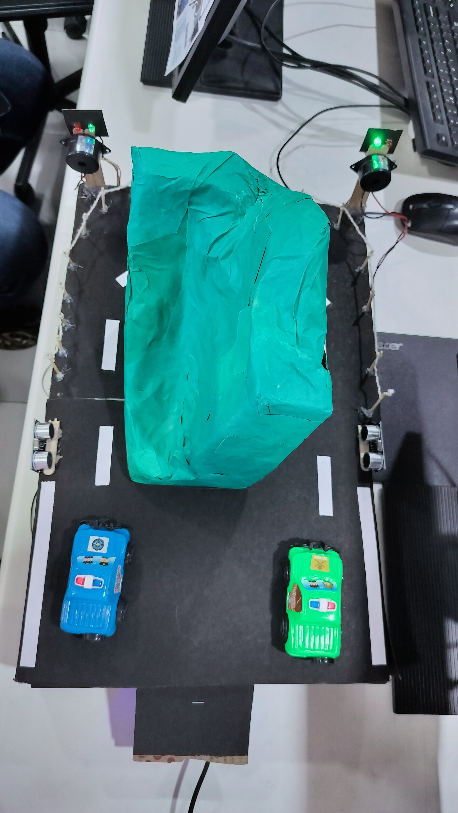
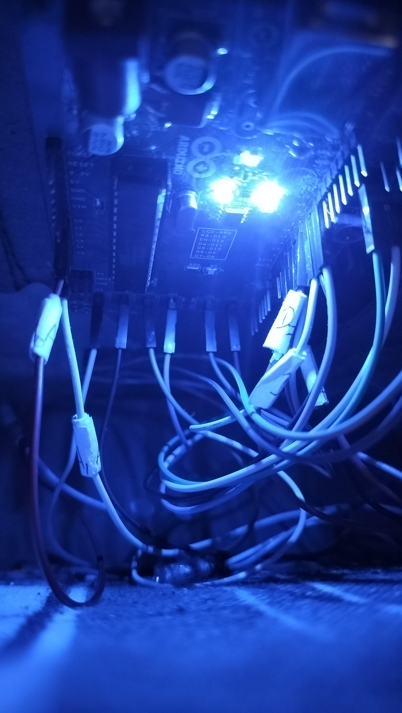
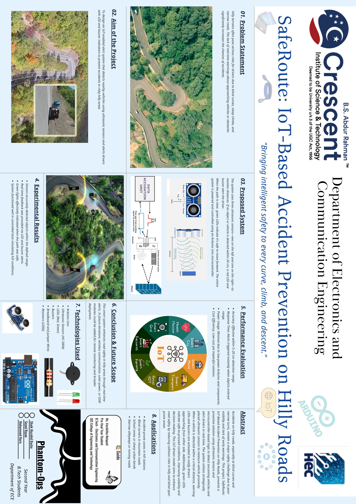

# SafeRoute: IoT-Based Accident Prevention on Hilly Roads

## Overview

SafeRoute is an IoT-based accident prevention system designed to improve safety on blind curves and hilly roads. The system uses ultrasonic sensors to detect approaching vehicles and provides real-time visual and audio warnings to drivers on the opposite side of the road.

This project demonstrates a low-cost embedded solution for reducing collisions caused by limited visibility in mountainous and curved road environments.

---

## Problem Statement

Blind curves and hilly roads often restrict driver visibility, increasing the risk of head-on collisions. Drivers approaching from opposite directions may be unaware of each other's presence until it is too late to react.

SafeRoute addresses this challenge by detecting vehicles near a blind turn and instantly alerting drivers approaching from the opposite side.

---

## Features

* Real-time vehicle detection
* Dual ultrasonic sensor monitoring
* Visual warning using LEDs
* Audio warning using buzzers
* Safe-route indication through green LEDs
* Arduino-based implementation
* Low-cost and scalable design

---

## Hardware Components

* Arduino Uno
* HC-SR04 Ultrasonic Sensor × 2
* Red LED × 2
* Green LED × 2
* Buzzer × 2
* Jumper Wires
* USB Power Supply

---

## Working Principle

1. Ultrasonic sensors are installed on both sides of a blind curve.
2. When a vehicle approaches one side, the sensor detects its presence.
3. Arduino processes the sensor data.
4. A red LED and buzzer are activated on the opposite side.
5. Drivers are warned about approaching traffic.
6. Green LEDs indicate safe passage when no vehicle is detected.

---
---

## Project Gallery

### Prototype Top View


### Warning System Active


### Project Poster


---

## Pin Configuration

| Component | Pin |
| --------- | --- |
| TRIG1     | D9  |
| ECHO1     | D10 |
| TRIG2     | D5  |
| ECHO2     | D6  |
| LED1      | D3  |
| LED2      | D4  |
| BUZZER1   | D7  |
| BUZZER2   | D8  |
| GREEN1    | D11 |
| GREEN2    | D12 |

---

## Repository Structure

```text
SafeRoute-IoT-Based-Accident-Prevention-on-Hilly-Roads
│
├── README.md
├── .gitignore
├── requirements.txt
│
├── code
│   └── SafeRoute.ino
│
├── images
│   ├── project_poster.jpg
│   ├── prototype_top_view.jpg
│   ├── warning_system_active.jpg
│   ├── arduino_controller.jpg
│   └── ultrasonic_sensor.jpg
│
└── videos
    └── safroute_demo.mp4
```

---

## Applications

* Hilly Roads
* Blind Curves
* Hairpin Bends
* Smart Transportation Systems
* Intelligent Traffic Management
* Road Safety Infrastructure

---

## Future Enhancements

* ESP32 Integration
* GSM Alert System
* Cloud-Based Monitoring
* Solar-Powered Deployment
* Wireless Communication Modules
* Traffic Analytics Dashboard

---

## Results

The prototype successfully detected approaching vehicles and generated real-time visual and audio warnings. The system demonstrated the feasibility of improving road safety on blind curves using low-cost IoT technology.

---

## Developer

Shaik Muzahid Basha

B.Tech – Electronics and Communication Engineering

B.S. Abdur Rahman Crescent Institute of Science and Technology

---

## License

This project is developed for educational and research purposes.
